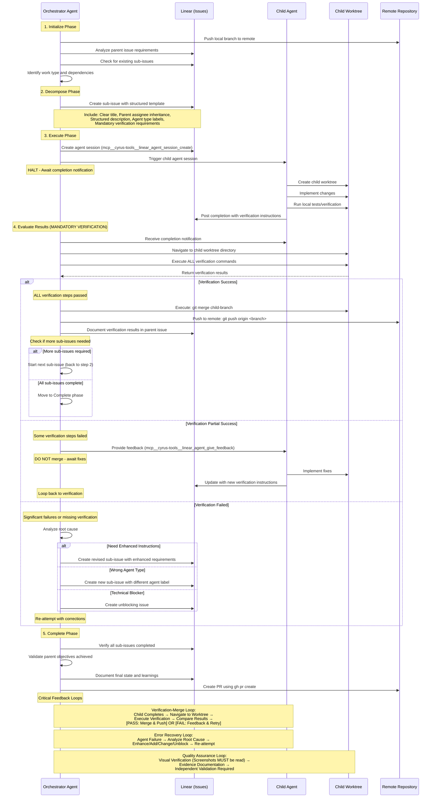

# Orchestrator Execution and Feedback Flow Diagram

This Mermaid diagram illustrates the execution and feedback flow sequence outlined in the orchestrator.md prompt.

## Key Flow Characteristics

### Sequential Processing
- Work is **not parallel** - only one sub-issue active at a time
- Next session only triggered after successful merge of current issue

### Mandatory Verification Gates
1. **Pre-Merge Gate**: Verification commands must pass in child worktree
2. **Visual Confirmation Gate**: All screenshots must be read/viewed for UI changes
3. **Evidence Gate**: Documentation of verification results required
4. **Integration Gate**: Confirm no regressions introduced

### State Tracking
- **Completed**: (with verification results)
- **Active**: (currently executing)
- **Pending**: (queued)
- **Blocked**: (awaiting resolution)

### Critical Quality Controls
- **NO BLIND TRUST**: Never merge based solely on child agent completion claims
- **VERIFICATION IS NON-NEGOTIABLE**: Every sub-issue must be independently validated
- **EVIDENCE-BASED DECISIONS**: Merge only after documented verification success
- **VISUAL CONFIRMATION REQUIRED**: Screenshots must be taken AND read/viewed

The diagram emphasizes the orchestrator's role as a quality gate that ensures rigorous validation through independent execution rather than trusting agent completion claims.